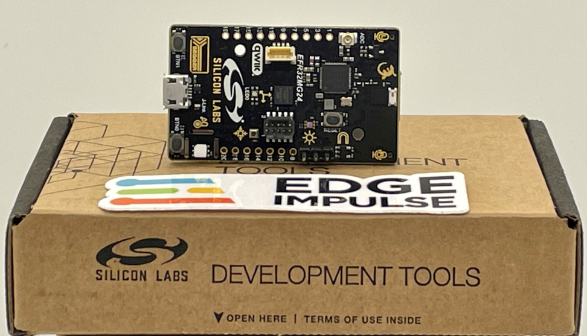
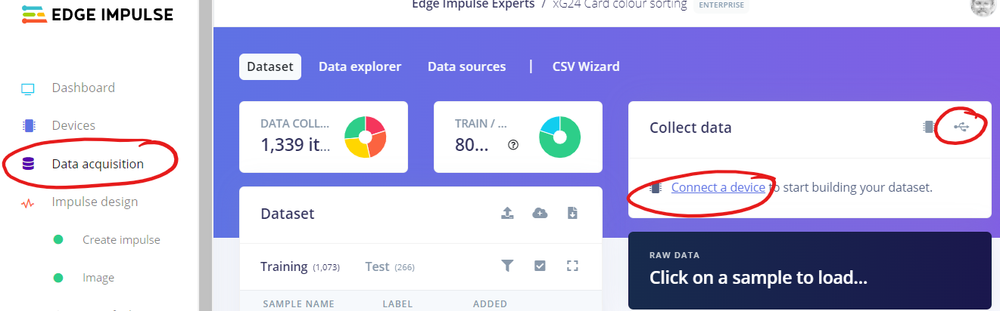
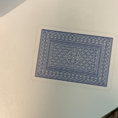

# Playing poker at the Edge, part 1 of 2

## Introduction

As sometimes happens to all of us, we are presented with a solution but don't yet have a problem to solve! In this case the solution was that I got the chance to borrow a programmable robot arm for a few weeks, but as the robot was delivered much earlier than expected, I had not yet thought about a use case for it. Among other things I needed to decide about what objects to pick and place using the suction cup, and also what software to use for controlling the robot. **Insert/rewrite** After some quick deliberation I decided to use playing cards as they are uniform in size and also lightweight. For the controlling software I had initially thought about only using Python, but I quickly moved on to explore how to also use TinyML (Tiny Machine Learning) for a more rewarding experience.

This project is part one of two, showing how to classify poker cards into three categories, by using Edge Impulse and a supported board, SiLabs xG24. Part two continues with using the same hardware setup for controlling the aforementioned robot arm to sort cards, but also showcases how to easily adapt the setup to sorting waste.

While one might think that classifying playing cards into only three classes is a piece of cake - actually it is when using Edge Impulse - the project also serves as a base to get started using the hardware and with a low learning curve. After you've got used with it, you can easily step up the ladder to more advanced projects.

 

## Use-case Explanation

As earlier mentioned I chose to classify playing cards for this project. While it is possible to classify cards into different suits, I decided to start simple by using three classes or labels: red cards, black cards, and cards with back side up. In addition I added a no card label to avoid the risk of an empty table being classified as a card. While classifying cards is pretty much straightforward, the typical rules also applied in this project: more images and also different type of images --> better performing model.

After initially having tested another board, I found that board to be a tad slow for my use case as the inferencing took over 1.2 seconds. Browsing through the boards Edge Impulse supports, I then decided to use the SiLabs xG24 dev kit together with an Arducam camera as I believed they would fit my purposes better. As it turned out, the inferencing was 3 times faster than the other board I'd tried!

The SiLabs xG24 dev kit is packed with sensors and features. Among the sensors are e.g. a relative humidity and temperature sensor, inertial sensor, stereo microphones, pressure sensor etc. Important features for this project was the Cortex-M33 processor, 256 kB RAM, and especially the AI/ML Hardware accelerator, and it can even be operated with a coin-cell battery! While it is not equipped with a camera, it supports e.g. the Arducam OV2640 board which I also used.

## Components and Hardware Configuration

### Hardware used:
* [SiLabs xG24-DK2601B EFR32xG24 Dev Kit](https://www.silabs.com/development-tools/wireless/efr32xg24-dev-kit?tab=overview)
* [Arducam B0067 2MP OV2640 SPI Camera for Arduino](https://www.welectron.com/Arducam-B0067-2MP-OV2640-SPI-Camera-for-Arduino_1)
* [Pin Header 2.54mm 1x20 Pin](https://www.welectron.com/Pin-Header-254mm-1x20-Pin) for soldering to the SiLabs board

### Configure the hardware:
* Solder the header to the board
* Connect the Dupont cable (came with the Arducam) to the headers according to the [camera assembly](https://docs.edgeimpulse.com/docs/tutorials/hardware-specific-tutorials/object-detection-xg24-devkit#camera-assembly)
    * Before powering on, double-check and triple-check the connection

**Important:** Avoid touching the board or camera when they are powered. I learned this the hard way and burned one board, probably through ESD (electrostatic discharge) when pressing the reset button. The blue magic smoke that was released was unhealthy for me and especially for my wallet...

 

 

## Data Collection Process

When collecting data for a machine learning (ML) application, it is generally better to use same device as will be used for inferencing. I started out with this assumption, but found it quite tedious to capture hundreds and hundreds of images with the xG24 and Arducam as it took up to 5 seconds per image. The reason for the slowness might be that the 256 kB RAM is not enough for storing one image, and instead the much slower flash memory needs to be used. Instead I moved onto using a mobile phone camera which made the data gathering process much faster, and almost fun, as I could take 3-4 images per second!

### Software and hardware used to capture data:

* [Edge Impulse Studio & CLI (Command-Line Interface)](https://www.edgeimpulse.com/)
* SiLabs xG24 was used for ~10 % of the data
    * to use this with Edge Impulse, you first need to flash the Edge Impulse firmware, detailed steps are found in the [documentation](https://docs.edgeimpulse.com/docs/development-platforms/officially-supported-mcu-targets/silabs-xg24-devkit)
* mobile phone camera (iPhone 12) was used for ~90 % of the data

### Steps to reproduce

* Collecting data with Edge Impulse is extremely easy with supported devices 
    * You can either use the [CLI (Command-Line Interface)](https://docs.edgeimpulse.com/docs/edge-impulse-cli/cli-overview), or like I did, use Studio by choosing `Connect a device` from the `Data acquisition` menu when using e.g. a mobile phone.
    * For details about how to use a mobile phone, please see the [documentation](https://docs.edgeimpulse.com/docs/development-platforms/using-your-mobile-phone).

 

 

* When connecting directly to a development board you instead choose `Connect using WebUSB`. Depending on the board, you can choose different sensors, or combination of sensors. In this case, I chose to use 96x96 as image size when capturing images with the xG24 board, this to avoid the need of resampling.

 

 

* To improve the accuracy of the model, I varied the illumination between using daylight and artificial light, and also by taking images from various angles and distances. Some of the images are even a bit blurry, but this is probably also making the model more robust. To be able to reuse the same images in part two, I deliberately also placed several cards on top of each other, sometimes with part of the underlying cards being visible. 

* As mentioned, the different classes (labels) I used are red cards, black cards, and cards with back side up. In addition, I also collected background and random images without having any card in them.  
 

 
Developing ML models is an agile and iterative process where it is often better to as quickly as possible test the model before spending too much time on it. Following this, I initially took only a few tens of images per class to test with, knowing that I'd most probably would need to gather more later. As is seen in the picture below, I ended up with a total of 1339 images with a 80% / 20% split between training and test data.  

   
  

 

## Building, Training, and Testing the Model

After you've collected some data, you need to build and train the model. The main steps in this process is to create an impulse, extract features, and finally train the model. Again, with image classification and when using Edge Impulse, this is often pretty straightforward.

### Steps to reproduce

In this project I knew beforehand that the 256 kB RAM memory would put some constraints on what model configuration to use. With 512 kB RAM I'd been able to use MobileNetV2 and 96x96 image size, and with 1M or more RAM I'd even been able to use MobileNetV2 and 160x160 image size. On the other hand, even if more memory can be beneficial, larger image sizes typically leads to longer inferencing times on the same device.

* Creating an impulse
    * Based on general recommendations, I chose to start with an image size of 96x96 pixels. I also chose to use `Squash` as `Resize mode` to not lose any data because of cropping. It might not actually have mattered in the end in this case, but as I used two completely different cameras (Arducam & Mobile Phone), having different aspect ratios, I wanted to avoid images from one camera being cropped where images from the other camera perhaps where not cropped similarly.
    * Unless you have specific needs, it is best to use `Ìmage` as `Processing block` and `Transfer Learning (Images)` as `Learning block`. Transfer learning means that you'll use a pre-trained image classification model on your data with only some fine-tuning. This generally leads to good performance even with relatively small image datasets.

 

* Next step is to extract features
    * For images you can choose between color or grayscale images. Whenever possible you should aim to use grayscale images as they consume much less memory and also can be processed much faster than colour images. In this project however, I chose to use RGB (colour) images as red and black look quite similar in grayscale, and the ML model might struggle to differentiate between them.

 

* Click on ´Generate features`, after a while you'll see the feature explorer visualizing how similar or dissimilar the classes are.

 

* Next step is to train the model
    * While it generally is best to start with the default settings, I needed to switch to MobileNetV1 instead of MobileNetV2 due to the memory constraints. MobileNetV2 *can* be used with 256 kB RAM, but then you need to reduce from 96x96 to e.g. 64x64 pixels. I'd tried this, but the results were not good.  
    * I discovered that changing the final layer to use 32 neurons, and the dropout rate to 0.01 worked well for this project.

 

 

* Click on `Start training` when you are ready to train the model
    * Depending on the number of images and training cycles, this step might take some time. Once it is ready you can see the performance in the graphs on the right.
    * Apart from when using "real" computers (e.g. Raspberry PI, Jetson Nano, etc.), you should only consider using quantized (int8) models as unoptimized (float32) models consumes much more memory and inferencing will be many times slower.
    * In the bottom right corner you'll see an estimation of the on-device performance. Use this to validate if the performance is acceptable for your use case, or if you need to rethink your model - or perhaps even change device - to accomplish your goals.
    * To speed up the search for an optimal ML model, you should take a look at the [EON Tuner](https://docs.edgeimpulse.com/docs/edge-impulse-studio/eon-tuner) as well!  

### Testing the Model

Before deploying the model to the device itself, you should check how well it works on data it has not seen before. This is where the 20 % test data that was put aside comes into play. If the model performs poorly on test data, you can expect real performance to be even worse. But even a 100 % accuracy on test data does not guarantee success in real life, so don't open the champagne bottle yet :-).

If the training performance is very good, but the test performance is poor, the reason might be that your model is overfitting on the training data. In that case you might need to collect more data, change the model or reduce its complexity. Now would be a good time to try the EON Tuner mentioned earlier.

 

 

In my case, after having deployed and tested the first model with the xG24 device, I found out that the real model performance was much worse than when testing with Edge Impulse. To troubleshoot this, I tested with my mobile phone instead and saw that the model performed close to 100 %. My hypothesis was that the cameras were too different, but perhaps by adding a few images taken by the device itself would make the model stronger. As a matter of fact, this was also what happened.

 

 

## Model deployment

When deploying the model to the xG24 device, you can choose between deploying a Simplicity Studio Component, or a firmware binary. Deploying as a Simplicity Studio Component means you'll have to use an external tool to compile a C++ program yourself, but on the other hand it provides you with many more options and features.

* In this project, I chose to deploy as a firmware binary. 

* To reduce the memory footprint, it is recommended to enable the EON Compiler.
* Once ready, click on `Build` to create the files to be deployed.
* After a few minutes the build process is complete, and instructions for flashing the firmware is shown. Follow the instructions to flash using the same Simplicity Commander you used earlier.

 

## Results

When you want to use the deployed model in a real scenario, you can again choose between different options, one of them being the command-line interface.

* When using the CLI for an image classification project, I recommend you use `edge-impulse-run-impulse --debug` as you can see a live picture and the inferencing result in a web browser. Note that this is the same picture as is used for inferencing, in this case 96x96 pixels which explains the pixelation and unsharpness:

 

* In addition you'll also see results as a log:

## Conclusion

# Results
Now it is time to show the finished project, deployed and running on the device.  Let’s talk about the results of running the model, presenting data, evidence, or statistics as appropriate.  Not all projects may meet their objectives, or perform well, but we should still present the outcomes truthfully.  If the project was extremely successful, then we can articulate on how the project could be scaled to truly make an impact.  If the project fell short of its goal, that is fine as well, and we can discuss what might have gone wrong, how the project could be improved, and provide lessons learned.  Screenshots or images might be needed here, as well.  

# Conclusion
A brief summary recapping what you built, why, and the outcome you achieved.  A few sentences wrapping up the project, any next steps you might take, or giving advice to the reader on how they can take your project and replicate it as-is, iterate, expand, or even scale your work.  All Expert Projects should be Public Projects, so explain that a reader can Clone your work and has access to your data, model, and can review the steps you took.  Reinforce the human health or machine health use case, and provide any final links or attribution.  

# DONE

# Intro / Overview
Briefly provide an introduction to your project. Address the following: what you are accomplishing, what the intended outcome is, highlight the use-case, describe the reasons for undertaking this project, and give a high level overview of the build. Provide a sentence or two for each of these aspects.  
Summarize the problem you are addressing in one or two sentences, and how your solution makes an impact.  Be sure to also give a brief introduction to the hardware you have chosen and any key features, or reasons why the selected hardware is a good fit for your project. 
Include a high-quality image of the hardware.

# Problem Being Solved / Use-case Explanation
Here we will go deeper into the problem that is being addressed.  We’ll want to provide evidence and data that the problem exists, and provide some possible improved outcomes and what we are hoping to achieve.  We need to establish credibility and demonstrate competence and innovation, so that readers have trust in the solution being presented.  This could be a good place to also further document the hardware features, sensors, or interfaces available on the board, describe what they do or what data they are intended to capture, and why that is important.  An image further detailing the problem or challenge would be useful, but might not be required depending upon the project.

# Components and Hardware Configuration
If any additional components are needed to build the project, include a list / Bill of Materials.  Normally this is formatted in a bulleted list, and quantity needed, to build the project.  After that, a description of how to set up the hardware, attach any sensors or secondary devices, flash any firmware or operating systems, install needed applications, and ultimately reach a point where we’re ready for Edge Impulse in the project.  We’ll definitely want some pictures of the hardware build process, showing the journey and setup that will guide readers through the process.

# Data Collection Process
Next we need to describe to a reader and demonstrate how data is collected.  Depending upon the type of the project, this might be done directly in the Edge Impulse Studio, via the use of a 3rd-party dataset, or data could be collected out in the field and later uploaded / ingested to Edge Impulse.  Data being captured should be explained, the specific process to capture it should be documented, and the loading of the data into Edge Impulse should be articulated as well.  Images will be helpful here, showing the device capturing data, or if you are making use of a pre-made dataset then you will need to describe where you acquired it, how you prepared the dataset for Edge Impulse, and what your upload process entails.  Pictures of the data capture and/or screenshots of loading the data will be needed.

# Training and Building the Model
Similar to the Data Collection Process section, a thorough description of the process used to build and train a model is important, so that readers can follow along and replicate your work.  Describe the elements in the Studio, the actions you take, and why.  Talk about the need for Training and Testing data, and when creating an Impulse,  Processing and Learning block options, Feature generation, and algorithm selection (FOMO, MobileNet, Yolo, etc) available to train and build the model.  Explain the selections you make, and the reasoning behind your choices.  Again images should be used here, screenshots walking a user through the process are very helpful.

# Model Deployment
Go into detail about the process of getting your resulting model into your application and onto your hardware.  This will of course vary by the target hardware, but explain what is occurring and how to flash your firmware, import the model if it’s a Linux device, or include a Library directly in your application.  Again describe the options presented to a user, and explain why you make the selections you do.  A few screenshots of the process would be useful.